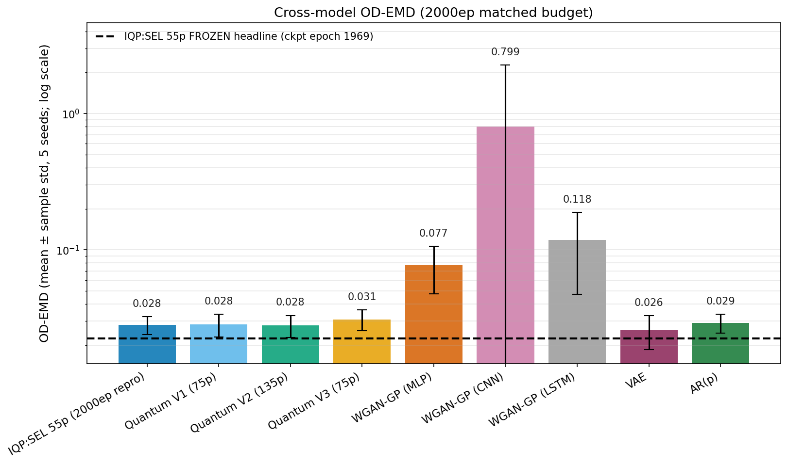
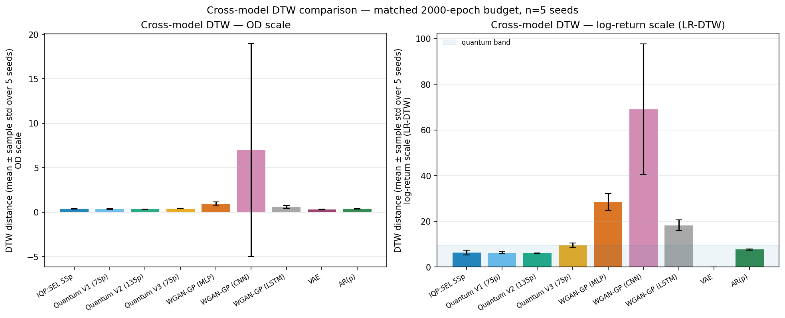

# qGAN — Quantum Generative Adversarial Network for Bioprocess Time Series

A Wasserstein GAN with Gradient Penalty (WGAN-GP) whose generator is a 5-qubit parameterized quantum circuit (PennyLane) and whose critic is a classical 1D-CNN (PyTorch). Trained on optical-density (OD) time series from a 20-litre photobioreactor cultivation; benchmarked against parameter-matched classical adversarial baselines (WGAN-MLP / WGAN-CNN / WGAN-LSTM) and non-adversarial controls (VAE, AR(p)).

This repository is the code + data + frozen-checkpoint package for the AIChE Journal manuscript *Quantum Synthetic Data Generation for Industrial Bioprocess Monitoring* (Gibford, Boskabadi, Savoie, Mansouri).

---

## Headline result

On a real bioprocess dataset, under a matched parameter budget and 2000 training epochs, the **quantum WGAN-GP cluster beats parameter-matched classical adversarial WGANs on every fidelity metric measured** — OD-EMD, OD-DTW, log-return EMD, and log-return DTW.



*OD-scale Earth Mover Distance (lower = better) across all 9 generators, mean ± sample std over 5 seeds. The 4 quantum variants cluster at 0.026–0.031 alongside VAE / AR(p); the three parameter-matched classical adversarial WGANs sit at 0.077 / 0.118 / 0.799 — a 3–30× gap.*



*Dynamic Time Warping on both OD and log-return scales tells the same story — the quantum cluster (blue/teal/yellow) holds the lower band; the WGAN cluster (orange/pink/grey) is consistently higher, with WGAN-CNN exhibiting the largest seed-42 outlier.*

The OD-DTW cluster separation is Welch-significant under family-wise Bonferroni correction; OD-EMD is significant uncorrected but does not survive Bonferroni. See `paper/supp_material.tex` §A.4 for the full statistical breakdown.

---

## Quick start

```bash
# 1 — clone
git clone https://github.com/shawngibford/qGAN.git
cd qGAN

# 2 — virtual env (Python 3.11 expected; macOS / Linux)
python -m venv qgan_env
source qgan_env/bin/activate

# 3 — install pinned deps (canonical paper environment)
pip install -r requirements-pinned.txt

# 4 — regenerate the headline metric from the frozen checkpoint
./qgan_env/bin/python scripts/run_canonical_headline.py

# 5 — recompile the manuscript PDF
cd paper && latexmk -pdf -bibtex main.tex
```

Use `requirements.txt` instead of `requirements-pinned.txt` for loose version bounds (development work).

---

## Repository layout

```
qGAN/
├── paper/         LaTeX manuscript + supplement + bib + compiled PDF
├── core/          Shared modules — quantum circuit, critic, training loop,
│                  preprocessing, eval metrics
├── scripts/       All runners (run_*.py / run_*.sh) and the two
│                  provenance/freeze verification gates
├── figures/       All paper figures (~380 files) — generated and static
├── results/       JSON provenance + raw run artifacts
│                  (matched2000/, baselines/, sensitivity/)
├── docs/          Methods, reviewer responses, peer-review trail,
│                  reproducibility manifests
├── tests/         Pytest suite for core/ and runner contracts
├── checkpoints/   Tracked headline checkpoint (best_checkpoint.pt)
├── legacy/        Pre-revision notebooks and artifacts (recoverable archive)
├── data.csv       Real OD trace from the photobioreactor cultivation
├── REPRODUCE.md   Full reviewer reproducibility entry-point
└── README.md      This file
```

---

## Reproduce the paper end-to-end

See [REPRODUCE.md](REPRODUCE.md) for the dependency-ordered command sequence:

1. `scripts/run_canonical_headline.py` → `results/headline_canonical.json`
2. `scripts/run_matched2000_dualscale.py` → `results/matched2000_dualscale.json`
3. `scripts/run_methods_full.py` → `docs/methods_full.md`
4. `scripts/run_figure_suite.py` → 380 figures under `figures/`
5. `scripts/verify_number_provenance.py --target paper/main.tex` → every paper literal traces back to a JSON value

The number-provenance gate guarantees that every numeric literal in the manuscript resolves to a tracked `results/*.json` or `figures/*.json` artifact at the stated precision — no manual values.

---

## Citation

If you use this code, please cite the AIChE Journal paper (DOI to be added at acceptance) and the architectural foundation:

> Orlandi et al. (2024). *Enhancing Financial Time Series Prediction with Quantum-Enhanced Synthetic Data Generation: A Case Study on the S&P 500 Using a Quantum Wasserstein GAN Approach with a Gradient Penalty.* Electronics, 13(11), 2158. [https://www.mdpi.com/2079-9292/13/11/2158](https://www.mdpi.com/2079-9292/13/11/2158)

---

## License

See [LICENSE](LICENSE).
