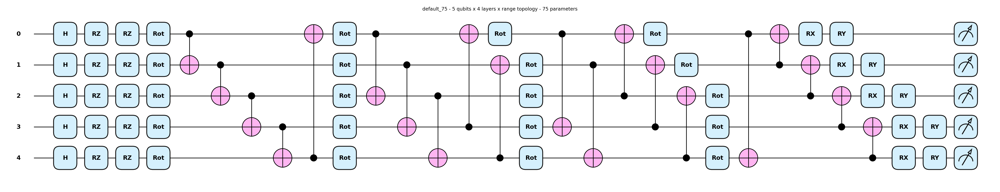
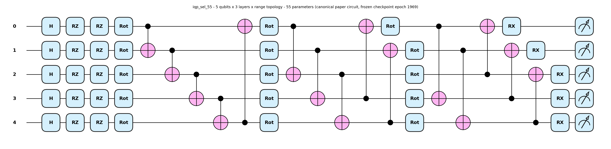
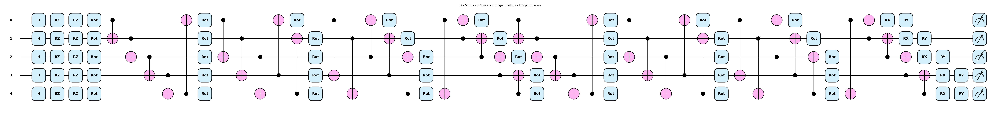
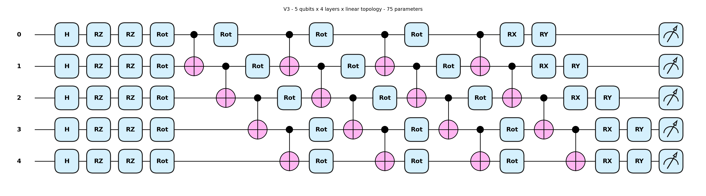

# Circuit Atlas — PAPER-03 Visualization Set

> **Source of truth:** every numeric literal in this doc resolves to one of the five
> config-lock JSONs under `results/` (canonical, default_75, v1, v2, v3).
> Re-run `run_circuit_diagrams.py` to (re)generate the locks AND the figures
> together; `verify_number_provenance.py --target docs/circuit_atlas.md`
> is the executable gate that proves every literal here resolves to a
> `results/*.json` value (success criterion 5). All five circuit diagrams are
> rendered with `qml.draw_mpl(qnode, style="pennylane")` — never a bespoke matplotlib
> gate drawing. This is an architecture atlas — no generation numbers (no EMD, no
> moments, no DTW); D-14-10 (headline vs reproduction conflation) does not apply here
> because there are no result numbers to conflate.

This atlas covers all five production quantum circuits used in the manuscript:

- **`default_75`** — the byte-frozen v1.0/v1.1 baseline circuit that Phases 8-13 trained
  against (preserved under D-14-22 byte-freeze).
- **`iqp_sel_55`** — the canonical paper circuit recovered from `best_checkpoint.pt`
  in Plan 14-01 (frozen checkpoint epoch 1969).
- **`V1` / `V2` / `V3`** — the matched-budget ansatz variants from
  `run_matched2000.py` (Plan 14-02), each trained fresh at the matched
  2000-epoch budget on seeds {42, 43, 44, 45, 46}.

---

## 1. `default_75` — Byte-frozen v1.0/v1.1 baseline

| spec | value |
| --- | --- |
| num_qubits | 5 |
| num_layers | 4 |
| topology | range |
| encoding | IQP (Hadamard + RZ per qubit) |
| variational block | SEL — Rot(phi, theta, omega) per qubit per layer |
| final rotations | RX+RY per qubit |
| param_count | 75 |

Source: `results/default_75_config_lock.json`
(`gate_layout_breakdown`: IQP encoding (5) + 4*SEL layers (15 each) + final RX+RY (10) = 75).

This is the v1.0/v1.1 byte-frozen circuit that every prior phase trained against — the
default returned by `QuantumGenerator()` with no arguments. It differs from
`iqp_sel_55` in two ways: it carries one extra SEL layer (4 vs 3) AND it ends with
final RX **and** RY per qubit (factor 2) instead of RX-only (factor 1), which is what
takes it from 55 parameters to 75. Holding `default_75` byte-frozen across
Phase 14 (D-14-22) is what guarantees Phases 8-13 are not silently re-baselined by the
non-default circuit additions of Phase 14.

---

## 2. `iqp_sel_55` — Canonical paper circuit (frozen checkpoint epoch 1969)

| spec | value |
| --- | --- |
| num_qubits | 5 |
| num_layers | 3 |
| topology | range |
| encoding | IQP (Hadamard + RZ per qubit) |
| variational block | SEL — Rot(phi, theta, omega) per qubit per layer |
| final rotations | RX_only per qubit |
| param_count | 55 |

Source: `results/canonical_config_lock.json`
(`decomposition.num_layers`=3, `param_count`=55, `final_rotation`=RX_only).

This is the canonical paper circuit reconstructed from `best_checkpoint.pt` in
Plan 14-01 (frozen checkpoint epoch 1969). It is shallower than `default_75`
(num_layers 3 instead of 4) AND uses RX-only final rotations instead of RX+RY — that
combination is what gives 55 parameters instead of 75. Wherever the manuscript reports
the FROZEN headline EMD, this is the circuit and these are the weights; the matched-
budget `iqp_sel_55_repro` reproduction trains this same architecture fresh at 2000 epochs
and is reported as a SEPARATE row-set (D-14-10).

---

## 3. `V1` — Matched-budget ansatz (range, depth 4, 75 params)

| spec | value |
| --- | --- |
| num_qubits | 5 |
| num_layers | 4 |
| topology | range |
| encoding | IQP (Hadamard + RZ per qubit) |
| variational block | SEL — Rot(phi, theta, omega) per qubit per layer |
| final rotations | RX+RY per qubit |
| param_count | 75 |

Source: `results/v1_config_lock.json`
(`source_path`: `run_matched2000.py:118`).

`V1` is structurally identical to `default_75` — same num_qubits, num_layers, topology,
gate layout, and param_count. The contrast is operational, not architectural: `V1` is
the matched-budget label under which the v1.0 ansatz is swept (5 seeds, 2000 epochs)
in `run_matched2000.py`, while `default_75` is the architectural label for the
underlying byte-frozen `circuit_id` that all three matched-budget V-variants share.

---

## 4. `V2` — Matched-budget ansatz (range, depth 8, 135 params)

| spec | value |
| --- | --- |
| num_qubits | 5 |
| num_layers | 8 |
| topology | range |
| encoding | IQP (Hadamard + RZ per qubit) |
| variational block | SEL — Rot(phi, theta, omega) per qubit per layer |
| final rotations | RX+RY per qubit |
| param_count | 135 |

Source: `results/v2_config_lock.json`
(`gate_layout_breakdown`: IQP encoding (5) + 8*SEL layers (15 each) + final RX+RY (10) = 135).

`V2` doubles the SEL depth of `default_75`/`V1` (8 layers instead of 4) while holding
num_qubits=5, topology=range, and final-rotation choice constant. The depth doubling
takes the parameter count to 135 (5 + 8*15 + 10 = 135). `V2` probes whether deeper
SEL stacks at the same topology pay off in the matched-budget 2000ep regime.

---

## 5. `V3` — Matched-budget ansatz (linear, depth 4, 75 params)

| spec | value |
| --- | --- |
| num_qubits | 5 |
| num_layers | 4 |
| topology | linear |
| encoding | IQP (Hadamard + RZ per qubit) |
| variational block | SEL — Rot(phi, theta, omega) per qubit per layer |
| final rotations | RX+RY per qubit |
| param_count | 75 |

Source: `results/v3_config_lock.json`
(`source_path`: `run_matched2000.py:122`).

`V3` matches `V1` and `default_75` exactly on depth and parameter count but swaps the
entangler topology from `range` (wrap-around `r = (layer % (num_qubits - 1)) + 1`) to
`linear` (q → q+1 chain). This isolates the topology variable: any matched-budget
performance gap between `V1` and `V3` is attributable to the entangling pattern alone.

---

## 6. Cross-comparison — At a glance

| circuit | num_qubits | num_layers | topology | final_rotation | param_count |
| --- | --- | --- | --- | --- | --- |
| `default_75` | 5 | 4 | range | RX+RY | 75 |
| `iqp_sel_55` | 5 | 3 | range | RX_only | 55 |
| `V1` | 5 | 4 | range | RX+RY | 75 |
| `V2` | 5 | 8 | range | RX+RY | 135 |
| `V3` | 5 | 4 | linear | RX+RY | 75 |

All five circuits share `num_qubits`=5 and the same IQP encoding + SEL variational
block structure (Hadamard + RZ per qubit; Rot(phi, theta, omega) per qubit per layer).
The variation axes across the matched-budget sweep are (num_layers, topology,
final_rotation), and the rows above cover the cross-product the manuscript reports on.

---

## 7. Provenance Footer

- All numeric literals in this doc resolve verbatim to one of:
  - `results/canonical_config_lock.json`
  - `results/default_75_config_lock.json`
  - `results/v1_config_lock.json`
  - `results/v2_config_lock.json`
  - `results/v3_config_lock.json`
- All five circuit diagrams were emitted by `run_circuit_diagrams.py`
  using `qml.draw_mpl(qnode, style="pennylane")` — never a bespoke matplotlib
  gate drawing.
- Gated by `./qgan_env/bin/python verify_number_provenance.py --target docs/circuit_atlas.md`.
